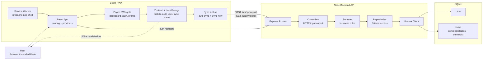
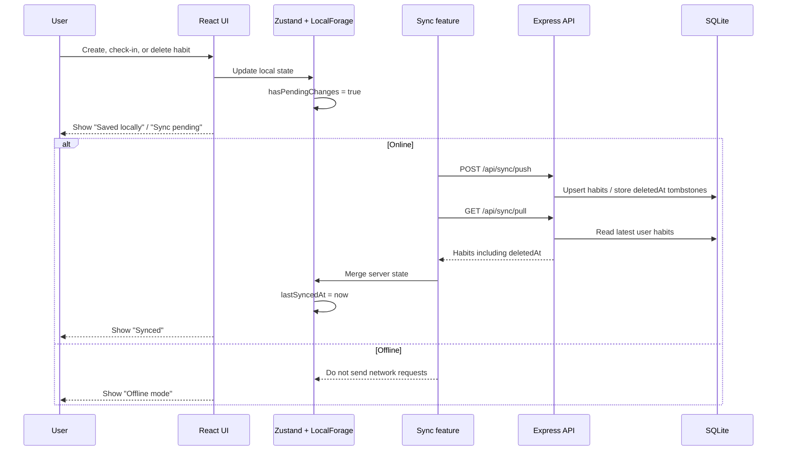
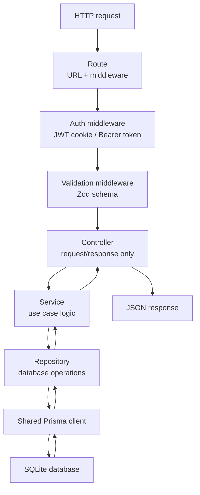

# Architecture

## Overview

The project is a monorepo with two runtime applications:

- `client` - browser PWA
- `server` - HTTP API and persistence layer

The goal of the current architecture is clean responsibility separation, testability, and easier long-term maintenance.

## Project infographic

## Offline-first sync flow

## Backend request flow

## Backend architecture

The backend uses a modular composition-root approach inspired by Nest-style separation of concerns, while still running on Express.

### Layers

- `routes` map URLs to controller handlers
- `controllers` work with HTTP details only
- `services` implement use cases and domain behavior
- `repositories` encapsulate Prisma access
- `modules` assemble dependencies
- `infrastructure` contains shared technical providers
- `common` contains cross-cutting middleware, error handling, and shared request types

### Dependency flow

`route -> controller -> service -> repository -> prisma`

Each lower layer does not depend on upper layers.

### Composition root

Module files create and connect concrete implementations:

- `server/src/modules/auth.module.ts`
- `server/src/modules/sync.module.ts`

This gives the project dependency injection style wiring without adding a full Nest runtime.

## Frontend architecture

The frontend uses a Feature-Sliced Design style structure.

### Layers

- `app` - providers, routing, application entry
- `pages` - full page composition
- `widgets` - assembled screen blocks
- `features` - user scenarios like auth and sync
- `entities` - domain state such as user and habits
- `shared` - UI primitives, API helpers, and utilities

### Responsibility rules

- pages should compose widgets and features, not contain raw API logic
- features should own scenario logic
- shared API utilities should centralize fetch behavior
- reusable UI should live in `shared/ui`
- widgets should group page-level visual structures that are reused or logically isolated

## Error handling

The backend uses a centralized error flow:

- services throw `AppError` for known business failures
- validation middleware forwards `ZodError`
- the global `errorHandler` transforms errors into HTTP responses

This keeps controllers thin and avoids repeated `try/catch` blocks.

## Persistence

Prisma is exposed through a shared singleton provider in:

- `server/src/infrastructure/prisma.ts`

Repositories receive Prisma through constructor injection, which improves testability and avoids scattering client construction.
